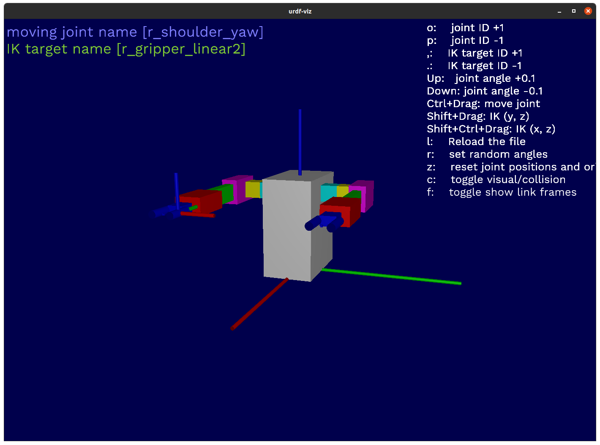
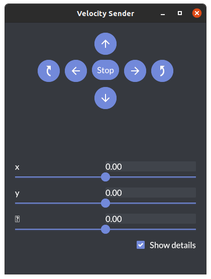
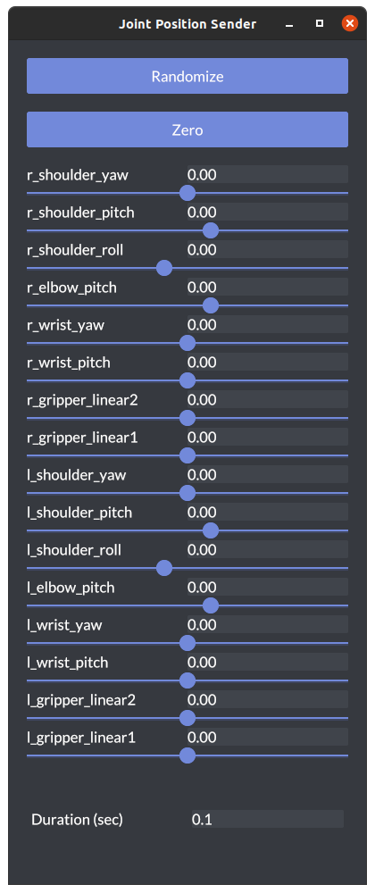

# 02-en Use OpenRR Apps

`openrr-apps` allows you to operate a basic robot. It is one of the applications using OpenRR, a framework implemented in Rust.

## Setup

### Installation of `urdf-viz`

[`urdf-viz`](https://github.com/openrr/urdf-viz.git) is a URDF visualization application.

```bash
cargo install urdf-viz
```

### Installation of `openrr-apps`

`openrr-apps` is an application that implements GUI, gamepad-based operations, etc. It can send commands, topics to ROS. Robots and real machines visualized by `urdf-viz` and `gazebo` can be operated in the same way.

For Linux and MacOS users.

```bash
cargo install --path openrr-apps
```

For Windows users.

```bash
cargo install --path openrr-apps --no-default-features --features gui,assimp
```

## robot command "`openrr_apps_robot_command`"

The `openrr_apps_robot_command` allows you to send several commands to the robot.

```bash
openrr_apps_robot_command [OPTIONS] [SUBCOMMAND]
```

| Options                         | Description                                                                                                  |
| ------------------------------- | ------------------------------------------------------------------------------------------------------------ |
| -c, --config-path <CONFIG_PATH> | Path to the setting file                                                                                     |
| --config <CONFIG>               | Set options from command line. These settings take priority over the setting file specified by --config-path |
| -h, --help                      | Print help information                                                                                       |
| -i, --interactive               | Use interactive mode                                                                                         |
| --log-directory <LOG_DIRECTORY> | Path to log directory for tracing FileAppender                                                               |
| --show-default-config           | Prints the default setting as TOML                                                                           |

| Subcommands                 | Description                                                                               |
| --------------------------- | ----------------------------------------------------------------------------------------- |
| cancel_navigation_goal      | Cancel navigation goal                                                                    |
| execute_command             | Execute an external command                                                               |
| get_navigation_current_pose | Get navigation current pose                                                               |
| get_state                   | Get joint positions and end pose if applicable                                            |
| help                        | Print this message or the help of the given subcommand(s)                                 |
| list                        | List available clients                                                                    |
| load_commands               | Load commands from file and execute them                                                  |
| move_ik                     | Move with ik [Usage of move_ik](#usage-of-move_ik)                                        |
| send_base_velocity          | Send base velocity  [Usage of send_base_velocity](#usage-of-send_base_velocity)           |
| send_joints                 | Send joint positions  [Usage of send_joints](#usage-send_joints)                          |
| send_joints_pose            | Send predefined joint positions [Usage of send_joints_pose](#usage-of-send_joints_pose)   |
| send_navigation_goal        | Send navigation goal pose [Usage of send_navigation_goal](#usage-of-send_navigation_goal) |
| shell_completion            | Shell completion [Usage of shell_completion](#usage-of-shell_completion)                  |
| speak                       | Speak text message                                                                        |

### Example

Start the robot on the simulator.

```bash
urdf-viz ./openrr-planner/sample.urdf &
```



After that, load robot command.

```bash
openrr_apps_robot_command --config-path ./openrr-apps/config/sample_robot_client_config_for_urdf_viz.toml load_commands ./openrr-apps/command/sample_cmd_urdf_viz.txt
```

### Example (--config)

Let's add a `--config` argument to the previous example. You can watch it run on `urdf-viz`, but for simplicity I have changed `load_commands` to `list`.

```bash
urdf-viz ./openrr-planner/sample.urdf &
openrr_apps_robot_command \
    --config-path ./openrr-apps/config/sample_robot_client_config_for_urdf_viz.toml \
    list
```

If you run it without doing anything first, you will get output like the first half of the previous section.

```toml
Raw joint trajectory clients
    r_arm
    l_arm
Joint trajectory clients
    r_arm
    r_arm_ik
    l_arm_collision_checked
    l_arm_ik
    r_arm_collision_checked
    l_arm
Collision check clients
    l_arm_collision_checked
    r_arm_collision_checked
Ik clients
    r_arm_ik
    l_arm_ik
```

The `--config` argument can override the contents of `--config-path`.

```bash
urdf-viz ./openrr-planner/sample.urdf &
openrr_apps_robot_command \
    --config-path ./openrr-apps/config/sample_robot_client_config_for_urdf_viz.toml \
    --config openrr_clients_config.ik_clients_configs[0].name=\"user_defined_ik\" \
    list
```

When this command is executed, the output is as follows

```toml
Raw joint trajectory clients
    l_arm
    r_arm
Joint trajectory clients
    l_arm
    r_arm_collision_checked
    l_arm_collision_checked
    r_arm
    r_arm_ik
    user_defined_ik
Collision check clients
    r_arm_collision_checked
    l_arm_collision_checked
Ik clients
    r_arm_ik
    user_defined_ik
```

The IK client name for the left arm has been changed to `user_defined_ik`. Of course this can also be accomplished by directly rewriting the toml file.

If you want to run it as `load_commands`, you need to change `l_arm_ik` to `user_defined_ik` in `openrr-apps/command/sample_cmd_urdf_viz.txt`.

### Usage of move_ik

```bash
openrr_apps_robot_command move_ik [OPTIONS] <NAME>
```

#### Name

IK client name

#### Option

| Options                                                                           | Description                                         |
| --------------------------------------------------------------------------------- | --------------------------------------------------- |
| -d, --duration <DURATION>                                                         |                                                     |
| -h, --help                                                                        | Print help information                              |
| -i, --interpolate                                                                 | Interpolate target in cartesian space               |
| -l, --local                                                                       |                                                     |
| --max_resolution_for_interpolation <MAX_RESOLUTION_FOR_INTERPOLATION>             | Max resolution for interpolation (default 0.5)      |
| --min_number_of_points_for_interpolation <MIN_NUMBER_OF_POINTS_FOR_INTERPOLATION> | Min number of points for interpolation (default 10) |
| -r, --roll <ROLL>                                                                 | Target roll                                         |
| -p, --pitch <PITCH>                                                               | Target pitch                                        |
| --yaw <YAW>                                                                       | Target yaw                                          |
| -x, --x <X>                                                                       | Target x coordinate                                 |
| -y, --y <Y>                                                                       | Target y coordinate                                 |
| -z, --z <Z>                                                                       | Target z coordinate                                 |

### Usage of send_base_velocity

```bash
openrr_apps_robot_command send_base_velocity [OPTIONS] <X> <Y> <THETA>
```

#### X

Velocity in y direction

#### Y

Velocity in y direction

#### Theta

Angular velocity

| Options                             | Description            |
| ----------------------------------- | ---------------------- |
| -d, --duration_secs <DURATION_SECS> |                        |
| -h, --help                          | Print help information |

### Usage send_joints

```bash
openrr_apps_robot_command send_joints [OPTIONS] <NAME>
```

#### Name

Client name

#### Option

| Options                                                                           | Description                                                                                                                                                                  |
| --------------------------------------------------------------------------------- | ---------------------------------------------------------------------------------------------------------------------------------------------------------------------------- |
| -d, --duration <DURATION>                                                         |                                                                                                                                                                              |
| -h, --help                                                                        | Print help information                                                                                                                                                       |
| -i, --interpolate                                                                 | Interpolate target in cartesian space. If you use this flag, joint values are not used as references but used in forward kinematics                                          |
| -j, --joint <JOINT>                                                               | Specify joint parameters. Like `--joint 0=1.2`. In accordance with the sequence in which the "joint names" are defined in the configuration, they are numbered starting at 0 |
| --max_resolution_for_interpolation <MAX_RESOLUTION_FOR_INTERPOLATION>             | Max resolution for interpolation (default 0.05)                                                                                                                              |
| --min_number_of_points_for_interpolation <MIN_NUMBER_OF_POINTS_FOR_INTERPOLATION> | in number of points for interpolation(default 10)                                                                                                                            |

### Usage of send_joints_pose

```bash
openrr_apps_robot_command send_joints_pose [OPTIONS] <NAME> <POSE_NAME>
```

#### Name

Client name

#### Pose name

Pose name

#### Option

| Options                   | Description            |
| ------------------------- | ---------------------- |
| -d, --duration <DURATION> |                        |
| -h, --help                | Print help information |

### Usage of send_navigation_goal

```bash
openrr_apps_robot_command send_navigation_goal [OPTIONS] <X> <Y> <YAW>
```

#### Option

| Options                           | Description            |
| --------------------------------- | ---------------------- |
| -f, --frame_id <FRAME_ID>         |                        |
| -h, --help                        | Print help information |
| -t, --timeout_secs <TIMEOUT_SECS> | Timeout second         |

### Usage of shell_completion

```bash
openrr_apps_robot_command shell_completion <SUBCOMMAND>
```

#### Subcommand

| Subcommand  | Description                                               |
| ----------- | --------------------------------------------------------- |
| bash        |                                                           |
| fish        |                                                           |
| help        | Print this message or the help of the given subcommand(s) |
| power_shell |                                                           |
| zsh         |                                                           |

## velocity sender "`openrr_apps_velocity_sender`"

The `openrr_apps_velocity_sender` allows you to specify a velocity to move the mobile robot.

```bash
openrr_apps_velocity_sender
```



### Usage

```bash
openrr_apps_velocity_sender [OPTIONS]
```

| Options                         | Description                                                                                                  |
| ------------------------------- | ------------------------------------------------------------------------------------------------------------ |
| -c, --config-path <CONFIG_PATH> | Path to the setting file                                                                                     |
| --config <CONFIG>               | Set options from command line. These settings take priority over the setting file specified by --config-path |
| -h, --help                      | Print help information                                                                                       |

## joint position sender "`openrr_apps_joint_position_sender`"

The `openrr_apps_joint_position_sender` allows you to specify the value of each joint for manipulators and other articulated robots.

```bash
openrr_apps_joint_position_sender
```



### Usage

```bash
openrr_apps_joint_position_sender [OPTIONS]
```

| Options                         | Description                                                                                                  |
| ------------------------------- | ------------------------------------------------------------------------------------------------------------ |
| -c, --config-path <CONFIG_PATH> | Path to the setting file                                                                                     |
| --config <CONFIG>               | Set options from command line. These settings take priority over the setting file specified by --config-path |
| -h, --help                      | Print help information                                                                                       |


## robot teleop "`openrr_apps_robot_teleop`"

With `openrr_apps_robot_teleop`, what used to be controlled on a GUI application can now be controlled remotely with a joystick or similar.

```bash
openrr_apps_robot_teleop
```

### Usage

```bash
openrr_apps_robot_teleop [OPTIONS]
```

| Options                         | Description                                                                                                  |
| ------------------------------- | ------------------------------------------------------------------------------------------------------------ |
|                                 |                                                                                                              |
| -c, --config-path <CONFIG_PATH> | Path to the setting file                                                                                     |
| -h, --help                      | Print help information                                                                                       |
| --log-directory <LOG_DIRECTORY> | Path to log directory for tracing FileAppender                                                               |
| --robot-config <ROBOT_CONFIG>   | Set options from command line. These settings take priority over the setting file specified by --config-path |
| --show-default-config           | Prints the default setting as TOML                                                                           |
| --teleop-config <TELEOP_CONFIG> | Set options from command line. These settings take priority over the setting file specified by --config-path |

### Example

Button names follow [gilrs layout](https://docs.rs/gilrs/latest/gilrs/#controller-layout).

Run `urdf-viz`. Then connect the gamepad to your PC, load and run the configuration file for Teleop.

```bash
urdf-viz ./openrr-planner/sample.urdf &
openrr_apps_robot_teleop \
    --config-path ./openrr-apps/config/sample_teleop_config_urdf_viz.toml
```

Pressing the assigned mode selection button (`North` by default) toggles the mode, and the sub-mode selection button (`East` by default) toggles the sub-mode.

```bash : output
PrintSpeaker: l_arm0
PrintSpeaker: r_arm0
PrintSpeaker: base
PrintSpeaker: left i k
PrintSpeaker: right i k
PrintSpeaker: pose l_arm_collision_checked zero
PrintSpeaker: l_arm0
PrintSpeaker: r_arm0
PrintSpeaker: r_arm1
PrintSpeaker: r_arm2
```

### Example (--teleop-config)

```bash
openrr_apps_robot_teleop \
    --config-path ./openrr-apps/config/sample_teleop_config_urdf_viz.toml \
    --teleop-config gamepad=\"keyboard\"
```

This is done in the same way as example (--config) in [robot command "`openrr_apps_robot_command`"](#robot-command-openrr_apps_robot_command), which is to overwrite existing settings.

In this example, the default operation with the gamepad is switched to operation from the keyboard.

## config "`openrr_apps_config`"

`openrr_apps_config` may not be used often; it outputs the result of overwriting the configuration file specified by `--config-path` or the schema for creating a toml file with `--config`.

```bash
openrr_apps_config
```

### Usage

```bash
openrr_apps_config [OPTIONS]
```

| Options    | Description            |
| ---------- | ---------------------- |
| -h, --help | Print help information |

| Subcommands | Description                                               |
| ----------- | --------------------------------------------------------- |
| help        | Print this message or the help of the given subcommand(s) |
| merge       |                                                           |
| schema      | Generate JSON schema for the specified config file        |

### Example

```bash
openrr_apps_config schema robot-config >openrr-apps/schema/robot_config.json
openrr_apps_config schema robot-teleop-config >openrr-apps/schema/robot_teleop_config.json
```

This is used in `./tools/update-schema.sh`.

### Example

```bash
openrr_apps_config merge \
    --config-path ./openrr-apps/config/sample_teleop_config_urdf_viz.toml \
    --config robot_config_path=\"sample_robot_client_config_for_urdf_viz_with_multiple_speaker.toml\"
```

This will output to `openrr-apps/config/example_config_merge.toml` what was specified as `sample_robot_client_config_for_urdf_viz.toml` in `sample_teleop_config_urdf_viz.toml` but replaced by `sample_robot_client_config_for_urdf_viz_with_multiple_speaker.toml`.
