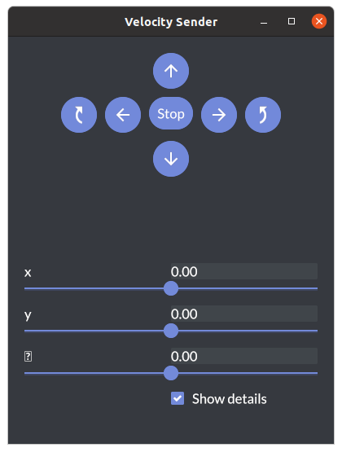

# Operating robot from GUI

## Move the robot arm

If you have not cloned `OpenRR`, do this.

```bash
git clone https://github.com:openrr/openrr
cd openrr
```

Let's display the sample robot arm.

```bash
urdf-viz ./openrr-planner/sample.urdf &
```


### `openrr_apps_joint_position_sender`

```bash
openrr_apps_joint_position_sender \
    --config-path ./openrr-apps/config/sample_robot_client_config_for_urdf_viz.toml
```

By sliding the bar, the joint angle of the robot arm can be specified.


## Move the mobile robot

```bash
urdf-viz ./openrr-planner/sample.urdf &
```

### `openrr_apps_velocity_sender`

```bash
openrr_apps_velocity_sender \
    --config-path ./openrr-apps/config/sample_robot_client_config_for_urdf_viz.toml
```

By sliding the bar, you can specify the robot's velocity and angular velocity.


