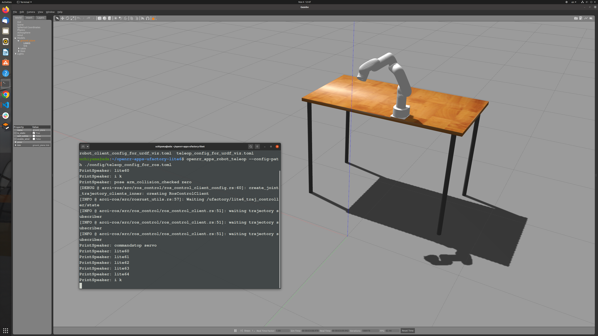

# Operating robot arm with ROS/ROS2 and openrr-teleop

## Ufactory Lite6 (ROS)

### Setup

[`xarm_ros`](https://github.com/xArm-Developer/xarm_ros)に従って、`ROS`用にロボットアームのセットアップをします。

```bash
mkdir -p ~/xarm_ws/src
cd ~/xarm_ws/src
git clone https://github.com/xArm-Developer/xarm_ros
cd xarm-ros
git pull
git submodule sync
git submodule update --init --remote
rosdep update
rosdep install --from-paths . --ignore-src --rosdistro noetic -y
cd ~/xarm_ws
catkin_make
```

`ROS`にfeatureしてOpenRRをビルドします。

```bash
cd openrr
cargo build --release --feature ros
cargo install --path ./openrr-apps
```

### Config file for client

ROSで用いられるジョイント名やトピックは`ros_clients_configs`に明記していきます。

また特定の姿勢に名前をつけて実行することも可能です。今回は、初期姿勢を決定し、`initial_pose`という名前で登録しました。(robot_client_for_ros.toml)

```toml
[[ros_clients_configs]]
name = "lite6"
joint_names = ["joint1", "joint2", "joint3", "joint4", "joint5", "joint6"]
complete_allowable_errors = [0.02, 0.02, 0.02, 0.02, 0.02, 0.02]
controller_name = "/ufactory/lite6_traj_controller"
state_topic_name = "/ufactory/lite6_traj_controller/state"

[openrr_clients_config]
urdf_path = "$(rospack find xarm_description)/urdf/lite6_robot.urdf.xacro"
self_collision_check_pairs = ["joint1:joint4"]

[[openrr_clients_config.ik_clients_configs]]
name = "arm_ik"
client_name = "arm_collision_checked"
solver_name = "arm_ik_solver"

[openrr_clients_config.ik_solvers_configs.arm_ik_solver]
ik_target = "joint_eef"

[[openrr_clients_config.collision_check_clients_configs]]
name = "arm_collision_checked"
client_name = "lite6"

[[openrr_clients_config.joints_poses]]
pose_name = "zero"
client_name = "arm_collision_checked"
positions = [0.0, 0.0, 0.0, 0.0, 0.0, 0.0]

[[openrr_clients_config.joints_poses]]
pose_name = "initial_pose"
client_name = "arm_collision_checked"
positions = [0.0, 0.17, 0.56, 0.0, 0.38, 0.0]
```

### Config file for teleop

- teleop_client_for_ros.toml

```toml
robot_config_path = "robot_client_config_for_ros.toml"

[control_nodes_config]

[control_nodes_config.joints_pose_sender_config]

[[control_nodes_config.ik_node_teleop_configs]]
solver_name = "arm_ik_solver"
joint_trajectory_client_name = "lite6"

[control_nodes_config.ik_node_teleop_configs.config]
mode = "i k"

[[control_nodes_config.joy_joint_teleop_configs]]
client_name = "arm_collision_checked"

[control_nodes_config.joy_joint_teleop_configs.config]
mode = "lite6"
```

実行したいコマンドを割り当てます。

- Command to be enable servo (enable_servo.txt)

```txt
openrr_apps_robot_commands execute_command -- rosservice call /ufactory/motion_ctrl 8 1

openrr_apps_robot_commands execute_command -- rosservice call /ufactory/set_mode 1

openrr_apps_robot_commands execute_command -- rosservice call /ufactory/set_state 0

openrr_apps_robot_command speak Default "Initialization completed!"
```

- Command for stop servo (stop_servo.txt)

```txt
openrr_apps_robot_commands execute_command -- rosservice call /ufactory/motion_ctrl 8 0
```

作成したTeleop fileに以下を追加します。(teleop_client_for_ros.toml)

```toml
...

[[control_nodes_config.command_configs]]
name = "stop servo"
file_path = "../command/stop_servo.txt"

[[control_nodes_config.command_configs]]
name = "enable servo"
file_path = "../command/enable_servo.txt"
```

ROSを有効化した後に以下の2つのコマンドを実行します。

```bash
roslaunch xarm_gazebo lite6_beside_table.launch
```

```bash
openrr_apps_robot_teleop --config-path ./config/teleop_config_for_ros.toml
```



もし`Lite6`をお持ちでしたら、以下の通りに実機を動かすことができます。

```bash
roslaunch lite6_moveit_config realMove_exec.launch robot_ip:=192.168.1.xxx
```

```bash
openrr_apps_robot_teleop --config-path ./config/teleop_config_for_ros.toml
```


## Ufactory Lite6 (ROS2)


### Setup

[`xarm_ros2`](https://github.com/xArm-Developer/xarm_ros2)に従って、`ROS2`用にロボットアームのセットアップをします。

```bash
mkdir -p ~/xarm_ws/src
cd ~/xarm_ws/src
git clone https://github.com/xArm-Developer/xarm_ros2
cd xarm-ros2
git pull
git submodule sync
git submodule update --init --remote
rosdep update
rosdep install --from-paths . --ignore-src --rosdistro $ROS_DISTRO -y
cd ~/xarm_ws
colcon build
```

`ROS2`にfeatureしてOpenRRをビルドします。

```bash
cd openrr
cargo build --release --feature ros2
cargo install --path ./openrr-apps
```

### Config file for client

ROS2ではプラグインとして明記していきます。

```toml
[plugins.arci_ros2]
# Path to OpenRR
path = "../../openrr/target/release/libarci_ros2"

[[plugins.arci_ros2.instances]]
name = "lite6"
type = "JointTrajectoryClient"
args = """
action_name = "/lite6_traj_controller"
"""

[openrr_clients_config]
urdf_path = "../lite6_robot.urdf"
self_collision_check_pairs = ["joint1:joint4"]

[[openrr_clients_config.ik_clients_configs]]
name = "arm_ik"
client_name = "arm_collision_checked"
solver_name = "arm_ik_solver"

[openrr_clients_config.ik_solvers_configs.arm_ik_solver]
ik_target = "joint_eef"

[[openrr_clients_config.collision_check_clients_configs]]
name = "arm_collision_checked"
client_name = "lite6"

[[openrr_clients_config.joints_poses]]
pose_name = "zero"
client_name = "arm_collision_checked"
positions = [0.0, 0.0, 0.0, 0.0, 0.0, 0.0]

[[openrr_clients_config.joints_poses]]
pose_name = "initial_pose"
client_name = "arm_collision_checked"
positions = [0.0, 0.17, 0.56, 0.0, 0.38, 0.0]
```

### Config file for teleop

Teleop fileはROSののものと同様にできます。

```toml
robot_config_path = "robot_client_config_for_ros2.toml"

[control_nodes_config]
joints_pose_sender_config.mode = "pose"

[[control_nodes_config.ik_node_teleop_configs]]
solver_name = "arm_ik_solver"
joint_trajectory_client_name = "lite6"

[control_nodes_config.ik_node_teleop_configs.config]
mode = "i k"

[[control_nodes_config.joy_joint_teleop_configs]]
client_name = "arm_collision_checked"

[control_nodes_config.joy_joint_teleop_configs.config]
mode = "lite6"
```

## Note

See also [xarm_ros](https://github.com/xArm-Developer/xarm_ros) and [xarm_ros2](https://github.com/xArm-Developer/xarm_ros2), [openrr-apps-ufactory-lite6](https://github.com/openrr/openrr-apps-ufactory-lite6)
