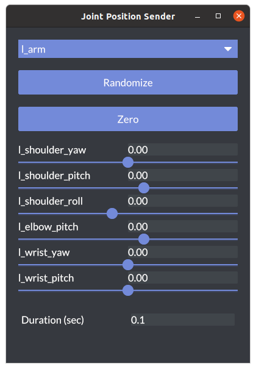

# Operating robot from GUI

## Move the robot arm

もし`OpenRR`をクローンしていなければ以下を実行してください。

```bash
git clone https://github.com:openrr/openrr
cd openrr
```

サンプルのロボットアームを表示させます。

```bash
urdf-viz ./openrr-planner/sample.urdf &
```


### `openrr_apps_joint_position_sender`

```bash
openrr_apps_joint_position_sender \
    --config-path ./openrr-apps/config/sample_robot_client_config_for_urdf_viz.toml
```

スライドバーを動かすことで、関節角を変更することができます。



## Move the mobile robot

```bash
urdf-viz ./openrr-planner/sample.urdf &
```

### `openrr_apps_velocity_sender`

```bash
openrr_apps_velocity_sender \
    --config-path ./openrr-apps/config/sample_robot_client_config_for_urdf_viz.toml
```

スライドバーを動かすことで、ロボットの速度と角速度を変更することができます。


