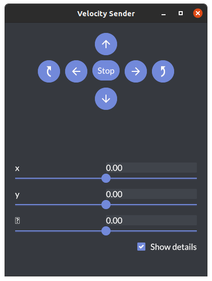

# openrr_apps_velocity_sender

`openrr_apps_velocity_sender`では移動ロボットを動かすための速度を指定することができます。

```bash
openrr_apps_velocity_sender
```



## 使い方

```bash
openrr_apps_velocity_sender [OPTIONS]
```

| Options                         | Description                                        |
| ------------------------------- | -------------------------------------------------- |
| -c, --config-path <CONFIG_PATH> | 設定ファイルへのパス                               |
| --config \<CONFIG>               | デフォルトまたは設定ファイルで指定した設定の上書き |
| -h, --help                      | ヘルプの出力                                       |
