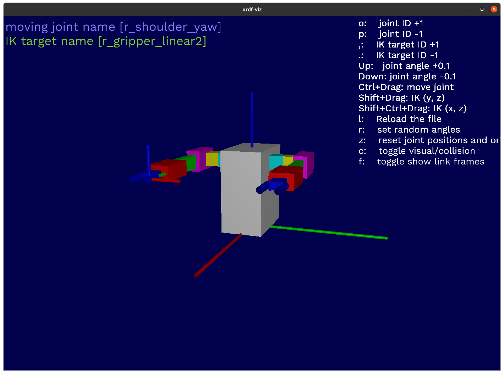

# Operating robot from CLI

## Move the robot arm

### From the command text file

もし`OpenRR`をクローンしていなければ以下を実行してください。

```bash
git clone https://github.com:openrr/openrr
cd openrr
```

サンプルのロボットアームを表示してみましょう。

```bash
urdf-viz ./openrr-planner/sample.urdf &
```



`load_commands`をtxtファイルに記したコマンドを実行するのに用いることができます。以下のコマンドを実行してみましょう。

```bash
openrr_apps_robot_command \
    --config-path ./openrr-apps/config/sample_robot_client_config_for_urdf_viz.toml \
    load_commands ./openrr-apps/command/sample_cmd_urdf_viz.txt
```

最後に以下のように出力されれば成功です。

```bash
PrintSpeaker: "This is sample robot"
```

### From your command line

`load_commands`を用いずに直接コマンドを書くことでも実行できます。試しにロボットアームの状態を取得してみましょう。

```bash
openrr_apps_robot_command \
    --config-path ./openrr-apps/config/sample_robot_client_config_for_urdf_viz.toml \
    get_state l_arm
```

以下のように出力されるでしょう。

```bash
Joint names : ["l_shoulder_yaw", "l_shoulder_pitch", "l_shoulder_roll", "l_elbow_pitch", "l_wrist_yaw", "l_wrist_pitch"]
Joint positions : [0.0, 0.0, 0.0, 0.0, 0.0, 0.0]
```

関節角を送信してみます。

```bash
openrr_apps_robot_command \
    --config-path ./openrr-apps/config/sample_robot_client_config_for_urdf_viz.toml \
    send_joints l_arm -j 0=1.2 -j 1=-1.2 -j 2=0.0 -j 3=1.2 -j 4=0.0 -j 5=0.0
```

ロボットアームが動きましたね。

## Robot client config file

これは単一ロボットアーム用のconfig fileの例です。シミュレータであっても実機であってもこのように記しておくことでOpenRRから操作ができます。

ただし、`urdf-viz`の項目である、`[urdf_viz_clients_configs]`だけROSやそれに類するもののために変更する必要があります。

```toml
[[urdf_viz_clients_configs]]
name = "arm"
joint_names = [
    "shoulder_yaw",
    "shoulder_pitch",
    "shoulder_roll",
    "elbow_pitch",
    "wrist_yaw",
    "wrist_pitch",
]
wrap_with_joint_position_limiter = true
# If joint_position_limits is not specified, limits will be got from URDF.
# The following values are the same as if getting limits from URDF.
joint_position_limits = [
    { lower = -3.0, upper = 3.0 },
    { lower = -2.0, upper = 1.5 },
    { lower = -1.5, upper = 2.0 },
    { lower = -2.0, upper = 1.5 },
    { lower = -3.0, upper = 3.0 },
    { lower = -2.0, upper = 2.0 },
]

[openrr_clients_config]
urdf_path = "{path_to_urdf}/sample.urdf"
self_collision_check_pairs = ["shoulder_yaw:gripper_linear1"]

# Client config for left arm
[[openrr_clients_config.collision_check_clients_configs]]
name = "arm_collision_checked"
client_name = "arm"

[[openrr_clients_config.ik_clients_configs]]
name = "arm_ik"
client_name = "arm_collision_checked"
solver_name = "arm_ik_solver"

[[openrr_clients_config.joints_poses]]
pose_name = "zero"
client_name = "arm_collision_checked"
positions = [0.0, 0.0, 0.0, 0.0, 0.0, 0.0]

[openrr_clients_config.ik_solvers_configs.l_arm_ik_solver]
ik_target = "tool_fixed"
```

## Note

See also [reference of `openrr_apps_robot_command`](../../reference/apps/robot_command.md)
