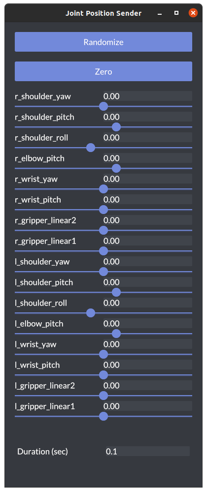

# openrr_apps_joint_position_sender

`openrr_apps_joint_position_sender`ではマニピュレータなど関節ロボットについての各関節の値を指定することができます。

```bash
openrr_apps_joint_position_sender
```



## 使い方

```bash
openrr_apps_joint_position_sender [OPTIONS]
```

| Options                         | Description                                        |
| ------------------------------- | -------------------------------------------------- |
| -c, --config-path <CONFIG_PATH> | 設定ファイルへのパス                               |
| --config <CONFIG>               | デフォルトまたは設定ファイルで指定した設定の上書き |
| -h, --help                      | ヘルプの出力                                       |
